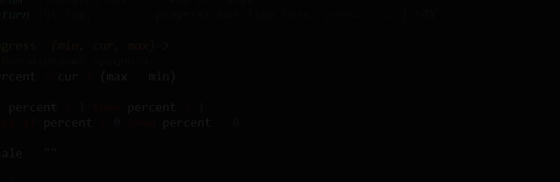

~~~js
visual = new Visual();

min = 0;

cur = 0;

max = 57;

a = setInterval(function() {
  var $cur, $max, $min, b;
  if (cur <= max) {
    visual.clear();
    console.log('\n');
    visual.drawProgress(min, cur, max);
    console.log('\n\n\n\n\n\n\n\n\n\n');
    return cur++;
  } else {
    clearInterval(a);
    $min = 0;
    $cur = 0;
    $max = 4;
    return b = setInterval(function() {
      visual.clear();
      console.log('\n');
      visual.drawProgress(min, cur, max);
      console.log('Congratulations');
      visual.$drawCat($cur);
      $cur++;
      if ($cur > $max) {
        return $cur = $min;
      }
    }, 200);
  }
}, 100);
~~~
