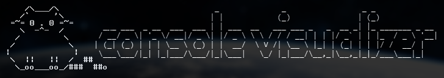

# The visualizer for the Node.js console



------------------------------------

## Installation
### NPM
```sh
npm install console-visualizer --save
```

------------------------------------

## Usage


~~~js
var Visualizer = require('console-visualizer');

var visual = new Visualizer({
    progress: {
        scale: {
            fill: "|",
            half: false
        }
    }
});

var loadMin = 0;
var loadCur = 0;
var loadMax = 100;

loadInterval = setInterval(function() {
    if (loadCur <= loadMax) {
        visual.clear(); // Clear console
        visual.drawProgress(loadMin, loadCur, loadMax); // Draw progress bar
        
        loadCur++;
    } else {
        clearInterval(loadInterval);
    }
}, 100);

/* Output:
[||||||||||          ] 50%
*/
~~~

------------------------------------

## Methods
### constructor(opts)
Object constructor
* `Object`  **opts**
    * `Object`      **progress** - Progress bar
        * `Integer`         **max_chars** - The maximum characters length in the console. __default: `80`__
        * `Boolean|Char`    **arrow** - __default: `false`__
        * `Object`          **text**
            * `Boolean`         **draw**    - __default: `true`__
            * `Boolean`         **floor**   - __default: `true`__
        * `Object`          **braces**
            * `Boolean|Char`    **open**    - __default: `"["`__
            * `Boolean|Char`    **close**   - __default: `"]"`__
        * `Object`          **scale**
            * `Char`            **fill**    - __default: `"="`__
            * `Boolean|Char`    **half**    - __default: `"-"`__
            * `Char`            **empty**   - __default: `" "`__

### clear()
Clear console

### getProgress(min, cur, max)
Generate progress bar like this 
```sh
[==========          ] 50%
```

* `Integer` **min** - start of range
* `Integer` **cur** - current value
* `Integer` **max** - end of range

* return `String`   - progress bar

### drawProgress(min, cur, max)
Draw progress bar in console. Based on the method [Visualizer#getProgress](#getProgress)
* `Integer` **min** - start of range
* `Integer` **cur** - current value
* `Integer` **max** - end of range

------------------------------------

## Build form coffee source
### Build project
The source code in the folder **development**. They should be compiled in the **bin** folder

```sh
# With watching
gulp
```

or

```sh
gulp build
```

### Build gulpfile

```sh
coffee -c gulpfile.coffee
```

------------------------------------

## Roadmap
* Add more visual progress bars. Like this

```coffee
###
      ________
     `.______,'
      (______)
      <      >
       )    (
      /`----.\
     /        \
    / _    _   \
   :,' `-.' `.' :
   | *    O   * |
   :    o   o   ;
    \ .  * .   /
     `.______.'
###
```

------------------------------------

## Changelog
### 1.0.0 [ `Stable` ]
* `Add` - first realise